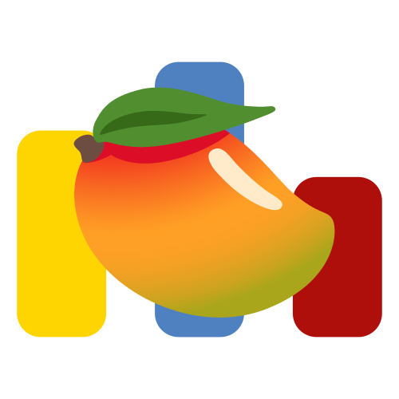

# Mango

A browser extension to enhance [Codeforces](https://codeforces.com) problem finding

**For practice**
- Mango is a browser extension designed to enhance your problem-solving experience on Codeforces by suggesting similar problems based on their tags and difficulty levels. Leveraging cosine similarity and a curated list of unique problem tags, Mango provides personalized recommendations to help you practice and improve your algorithmic skills.

## Installation Instructions
**Google Chrome / Microsoft Edge**
1. Go to [releases](https://github.com/prak132/Mango/releases/) and download the latest version.
1. Unzip the file and you should have a folder named `Mango`.
1. In Chrome/Edge go to the extensions page (`chrome://extensions` or `edge://extensions`).
1. Enable Developer Mode.
1. Drag the `Mango` folder anywhere on the page to import it (do not delete the folder afterwards).

## Features

- **Cosine Similarity:** Mango calculates the similarity between a target problem and other problems in the Codeforces problem set using cosine similarity.
- **Tag-Based Matching:** Mango matches problems based on their tags, ensuring that recommended problems share common themes and concepts with the target problem.
- **Dynamic Rating Adjustment:** Mango adjusts the similarity scores based on the rating (difficulty) of the target problem and the recommended problems.
- **Real-Time Suggestions:** Mango fetches problem data in real time from the Codeforces API, ensuring that recommendations are up-to-date and relevant to your current interests.

## Contributing

Mango is an open-source project, and contributions are welcome! If you have any suggestions, bug reports, or feature requests, please feel free to [open an issue](https://github.com/prak132/Mango/issues) or submit a pull request.

## License

Mango is licensed under the [MIT License](https://opensource.org/licenses/MIT), allowing for free distribution and modification. See the [LICENSE](https://github.com/prak132/Mango/blob/main/LICENSE) file for details.

Mango is developed and maintained by [prak132](https://github.com/prak132) and [dycoke](https://github.com/dycoke).
